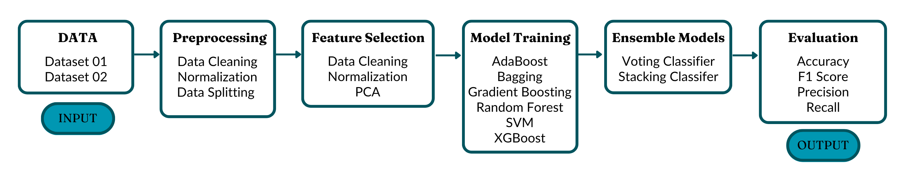

## 📄 Paper

**Title**  
**Protecting Student Mental Health with a Context-Aware Machine Learning Framework for Stress Monitoring**

**Authors**  
Md Sultanul Islam Ovi, Jamal Hossain, Md Raihan Alam Rahi, Fatema Akter

**Abstract**  
Student mental health is an increasing concern in academic institutions, where stress can severely impact well-being and academic performance. Traditional assessment methods rely on subjective surveys and periodic evaluations, offering limited value for timely intervention. This paper introduces a context-aware machine learning framework for classifying student stress using two complementary survey-based datasets covering psychological, academic, environmental, and social factors. The framework follows a six-stage pipeline involving preprocessing, feature selection (SelectKBest, RFECV), dimensionality reduction (PCA), and training with six base classifiers: SVM, Random Forest, Gradient Boosting, XGBoost, AdaBoost, and Bagging. To enhance performance, we implement ensemble strategies, including hard voting, soft voting, weighted voting, and stacking. Our best models achieve 93.09% accuracy with weighted hard voting on the Student Stress Factors dataset and 99.53% with stacking on the Stress and Well-being dataset, surpassing previous benchmarks. These results highlight the potential of context-integrated, data-driven systems for early stress detection and underscore their applicability in real-world academic settings to support student well-being.

**Conference**  
_Submitted to a Conference_

**PDF**  
[ArXiv](https://arxiv.org/abs/2508.01105)

**BibTeX**

```bibtex
@article{ovi2025protecting,
  title={Protecting Student Mental Health with a Context-Aware Machine Learning Framework for Stress Monitoring},
  author={Ovi, Md Sultanul Islam and Hossain, Jamal and Rahi, Md Raihan Alam and Akter, Fatema},
  journal={arXiv preprint arXiv:2508.01105},
  year={2025}
}
```

#### Overview


---

## 🔗 Resources

### Datasets

- [Mental Health Data Set](https://www.kaggle.com/datasets/mdsultanulislamovi/student-stress-monitoring-datasets)


## 📁 Datasets Used

### Dataset 01:

- **File:** stressLevelDataset.csv
- **Rows:** 1100
- **Columns:** 21
- **Missing Values:** No
- **Duplicates:** None
- **Target:** stress_level (3 classes)
This dataset includes psychological, physiological, academic, social, and environmental stress factors reported by students in a nationwide survey.
---

### Dataset 02:

- **File:** Stress Dataset.csv
- **Rows:** 843
- **Columns:** 26
- **Missing Values:** No
- **Duplicates:** 27
- **Target:** Type of stress (eustress or distress or no stress)

Collected via Google Forms, this dataset captures emotional, academic, and health-related stress indicators from college students aged 18–21.

---

## ✅ Results

### Dataset 01: Student Stress Factors

| ML Model                          | Configuration       | Accuracy | F1 Score | Recall  | Precision |
| --------------------------------- | ------------------- | -------- | -------- | ------- | --------- |
| Voting Classifier (hard)          | Mixed Preprocessing | 93.091%  | 93.099%  | 93.086% | 93.126%   |
| Voting Classifier (weighted_hard) | Mixed Preprocessing | 93.091%  | 93.091%  | 93.086% | 93.099%   |
| Random Forest                     | SelectKBest         | 92.364%  | 92.365%  | 92.356% | 92.378%   |
| Voting Classifier (soft)          | Mixed Preprocessing | 92.364%  | 92.356%  | 92.356% | 92.356%   |
| Voting Classifier (weighted_soft) | Mixed Preprocessing | 92.364%  | 92.365%  | 92.356% | 92.378%   |
| AdaBoost                          | SelectKBest         | 92.000%  | 92.005%  | 92.083% | 92.121%   |
| XGBoost                           | SelectKBest         | 91.636%  | 91.636%  | 91.776% | 92.014%   |
| Gradient Boosting                 | SelectKBest         | 91.273%  | 91.279%  | 91.404% | 91.498%   |
| Stacking Classifier               | Mixed Preprocessing | 91.273%  | 91.252%  | 91.220% | 91.317%   |
| Support Vector Machine            | PCA                 | 90.546%  | 90.557%  | 90.551% | 90.567%   |
| Bagging                           | SelectKBest         | 89.455%  | 89.493%  | 89.508% | 89.716%   |

---

### Dataset 02: Stress and Well-being Data

| ML Model                          | Configuration       | Accuracy | F1 Score | Recall  | Precision |
| --------------------------------- | ------------------- | -------- | -------- | ------- | --------- |
| Stacking Classifier               | Mixed Preprocessing | 99.530%  | 97.950%  | 99.830% | 96.300%   |
| Support Vector Machine            | PCA                 | 99.052%  | 96.494%  | 93.939% | 99.656%   |
| Voting Classifier (weighted_hard) | Mixed Preprocessing | 99.052%  | 96.494%  | 93.939% | 99.656%   |
| Voting Classifier (weighted_soft) | Mixed Preprocessing | 99.052%  | 96.494%  | 93.939% | 99.656%   |
| Voting Classifier (soft)          | Mixed Preprocessing | 97.630%  | 89.942%  | 83.712% | 99.154%   |
| Voting Classifier (hard)          | Mixed Preprocessing | 97.156%  | 87.318%  | 79.546% | 98.990%   |
| AdaBoost                          | Original Data       | 96.683%  | 85.866%  | 79.372% | 94.818%   |
| XGBoost                           | SelectKBest         | 96.209%  | 82.058%  | 73.485% | 98.667%   |
| Gradient Boosting                 | Normalized Data     | 95.735%  | 79.044%  | 69.318% | 98.508%   |
| Random Forest                     | SelectKBest         | 94.787%  | 72.332%  | 63.258% | 98.194%   |
| Bagging                           | SelectKBest         | 94.313%  | 68.831%  | 59.091% | 98.039%   |

---
